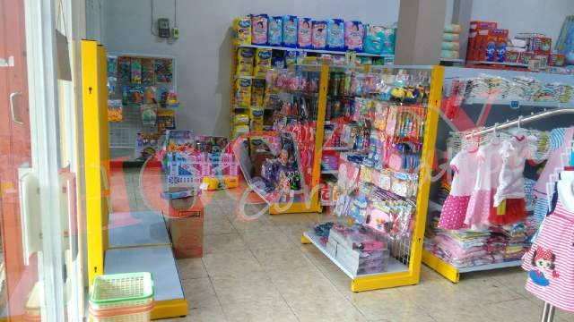

Bagaimana cara menghitung anggaran belanja dalam peremajaan atau pembukaan toko shop store baru.

###[cara menghitung anggaran belanja](/anggaranbelanja).

Tentu kita ingin tau untuk cek berapa sih habisnya biaya yang harus kita keluarkan untuk membuka toko baru atau melakukan peremajaan pada shop store yang sudah old school ini.

Langkah awal tentu menghitung dahulu apa saja yang harus kita rombak dalam ruangan yang akan kita gunakan dalam renovasi guna mendukung desain.Selanjutnya kita dapat menghitung kebutuhan terlebih dahulu buatlah list apa saja kebutuhan mu. misalnya rak display , meja kasir dan mesin kasir hingga produk produk baru.

Setelah membuat list maka selanjut nya tinggal lakukan eksekusi prakiraan nominal budget dan anggaran yang harus dikeluarkan untuk peremajaan maupun membuat usaha bisnis baru.

Kebutuhan produk : untuk kebutuhan produk produk yang akan dijual maka langkah awal wajib bertanya kepada supplier untuk kebutuhan produk produk display apa saja yang kamu perlukan dan buatlah sebagai list produk.

Khusus untuk rak display meja kasir dan mesin kasir maka wajib dilakukan pengukuran terlebih dahulu secara detail berapa panjang lebar luas toko bangunan shop , selanjutnya kita dapat menghitung kebutuhan untuk rak display dan lain lain, cara penghitungan nya cukup mudah rak kami memiliki spesifikasi panjang 90cm/unit dan variant lebar yang bisa di tentukan untuk menunjang desain interiro toko mu,atau hubungi staff kami untuk membantu mendesain hingga mengkalkulasi kebutuhan anggaran biaya belanja kamu, disini catat sebagai list penunjang.

Khusus untuk usaha baru langkah terbaik adalah membuat usaha yang berbadan hukum resmi agar memudahkan dalam setiap kebutuhan mu kedepan nantinya, cari info biaya pembuatan badan usaha dan masukan list perijinan .

Setelah itu mulai lah persiapan perkekrutan karyawan nah disini buatlah list kebutuhan untuk posisi dan berapa besar gaji SDM,dan masukan pada list staff.

Untuk mengangkat pemasaran maka promosi adalah mutlak maka cari info via iklan apa akan kamu pasarkan produk dan usaha mu, selanjutnya masukan biaya iklan pada list adds.

Saran lebih baik menggunakan tempat kepemilikan sendiri agar tidak membebani kedepan nantinya, jika sewa maka pastikan pemasaran akan terus berjalan dengan strategi strategi marketing yang selalu update dan fresh untuk membantu penjualan.mauskan pada list property.

Dan jangan lupa selalu persiapkan biaya tak terduga.

Nah setelah itu semua kini kita tinggal hitung list diatas maka akan keluar prakiraan anggaran belanja dalam peremajaan usaha maupun pembukuaan toko usaha baru mu.

Klik list untuk detail produk kami.
+ [Rak besi ram jaring murah](/rakmurah)
+ [Rak minimalis full plat besi](/rakminimalis)
+ [Rak heavy minimalis](/rakfarmasigudang)
+ [Meja kasir besi](/mejakasir)
+ [Mesin kasir system](/mesinkasir)
+ [Alarm security](/alarm)