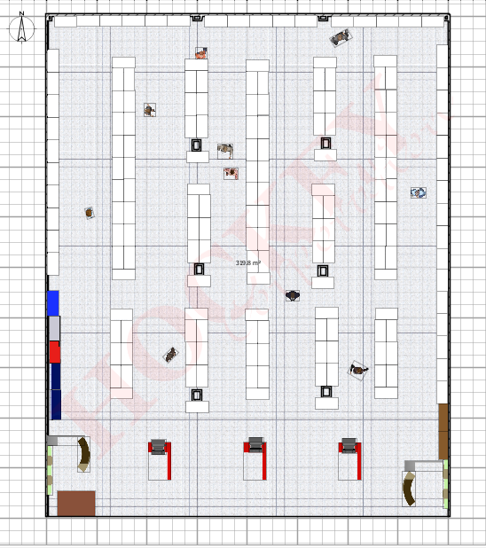
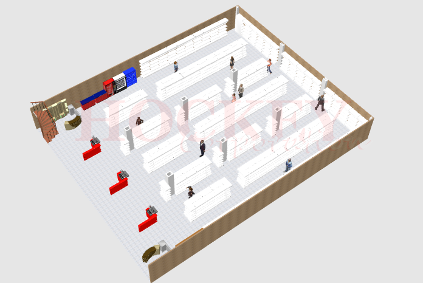

Bagaimana cara mendesain interior toko shop store outlet agar lebih menarik animo pengunjung dengan estetika interior design terbaik.

###[cara mendesain toko](/desaintoko).

Untuk mendesain interior usaha perlu kiranya kita mengukur terlebih dahulu untuk luas toko , ketinggian dan selanjutnya buat ide inspirasi untuk menatata toko minimarket mart agar lebih modern , kesan up date memberikan kenyamanan pada pelanggan dalam berbelanja, sekaligus wajib diperhatikan adalah kebersihan hingga produk produk yang tertata rapi plus informasi detail produk pastikan tersedia seperti harga brosur dan lain lain sehingga memudahkan pelanggan dalam mempercepat belanja hingga memperoleh informasi produk.

Ruangan yang luas dan besar akan memberikan tingkat kesulitan lebih tinggi pada berbagai aspek namun kita dapat berkreasi lebih untuk mendesain interior, jangan menggunakan desain yang terlalu kaku jika mempunyai ruangan yang luas gunakan pembagian tema akan membantu dalam mempercantik interior, tentunya permainan aksesoris juga mampu untuk dijadikan point plus dalam mempercantik ruangan.

Ruangan yang kecil dan sedang lebih baik dengan penataan desain dengan tema konsep fresh and clean dengan basic warna putih pada background yang mampu membuat ruangan terlihat lebih bersih luas dalam kebutuhan desain.

Gunakan Pilar pilar pada bangunan untuk kretatifitas mu,pilar mungkin terlihat mengganggu jika dibiarkan saja, maka dari itu buatlah ide agar pilar nampak lebih menarik dengan aksesoris atau banner brosur display membantu dalam mempercantik tampilan pilar pada bangunan.

Selanjutnya pilih rak display yang digunakan dalam memajang produk produk tentunya rak display ini juga disesuaikan dengan tema ruangan kamu, misalnya pewarnaan dan konsep harus sesuai dengan tema, gunakan rak kayu jika usaha mengusung tema vintage. dan gunakan rak besi jika ingin konsep minimarket shop toko modern.

Untuk kerapian dan lebih menarik jangan hiraukan untuk menggunakan counter cashier disini kamu dapat menggunakan meja kasir sesuai kebutuhan desain kamu bisa buat dan pesan pada tukang mebel furniture untuk menunjang konsep tema usaha,atau gunakan meja kasir kami untuk modern mart style system.

Peghitungan kebutuhan rak display dan meja kasir diwajibkan mengetahui terlebih dahulu lebar panjang bangunan, selanjutnya hitung masing masing spesifikasi rak display,maka akan ketemu kebutuhan yang akan kamu gunakan.

Hmm... ribet pengen langsung jadi ?? hubungi kami untuk kami bantu desain kan sesuai dengan kondisi ruangan toko shop store outlet atau konsultasikan kebutuhan desain interior mu kepada kami.

Klik list untuk detail produk.
+ [Rak besi ram jaring murah](/rakmurah)
+ [Rak minimalis full plat besi](/rakminimalis)
+ [Rak heavy minimalis](/rakfarmasigudang)
+ [Meja kasir besi](/mejakasir)
+ [Mesin kasir system](/mesinkasir)
+ [Alarm security](/alarm)