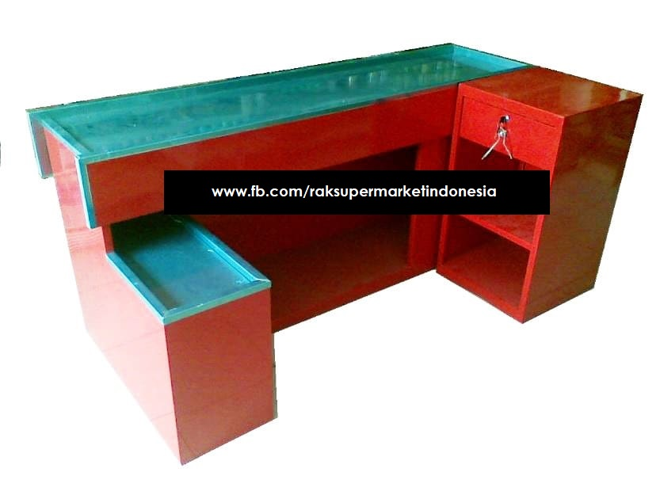

Meja kasir itu untuk apa sih ?? apa manfaat menggunakan meja kasir.

###[meja kasir](/fungsimejakasir).

Meja kasir adalah sebuah meja yang diperuntukan bagi kasir atau biasa berada pada kasir pos point of sale penjualan,apa saja sih fungsi meja kasir ini sebenarnya. 

Banyak manfaat dalam menggunakan meja kasir , tentunya agar ruangan toko usaha nampak lebih mewah dan elegan selain itu juga mampu merapikan antrian pada pengunjung, memudahkan dalam kebutuhan untuk berinteraksi dengan pengunjung dengan adanya antrian sehingga kasir lebih tenang dalam menjalankan tugas nya.

Space untuk mesin kasir , meja kasir mampu dijadikan tumpuan untuk space mesin kasir agar memudahkan kasir bertransaski dengan cepat dan sekaligus tempat untuk peralatan kasir seperti printer kasir untuk mencetak struk penjualan hingga laci kasir untuk mediasi penyimpanan uang transaksi pada kasir.

Sebagai tempat dan packing belanja pelanggan, memudahkan pelanggan untuk meletakan seluruh belanjaan nya dan sekaligus packing belanjaan transaksi pelanggan semakin lebih cepat dengan space counter cashier dalam kebutuhan nya.

Klik list untuk detail produk.
+ [Rak besi ram jaring murah](/rakmurah)
+ [Rak minimalis full plat besi](/rakminimalis)
+ [Rak heavy minimalis](/rakfarmasigudang)
+ [Meja kasir besi](/mejakasir)
+ [Mesin kasir system](/mesinkasir)
+ [Alarm security](/alarm)