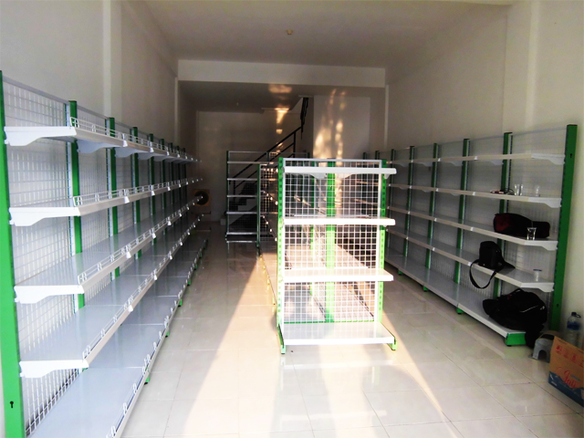
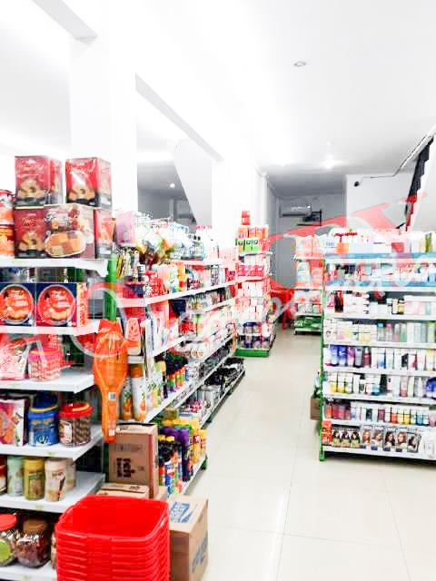
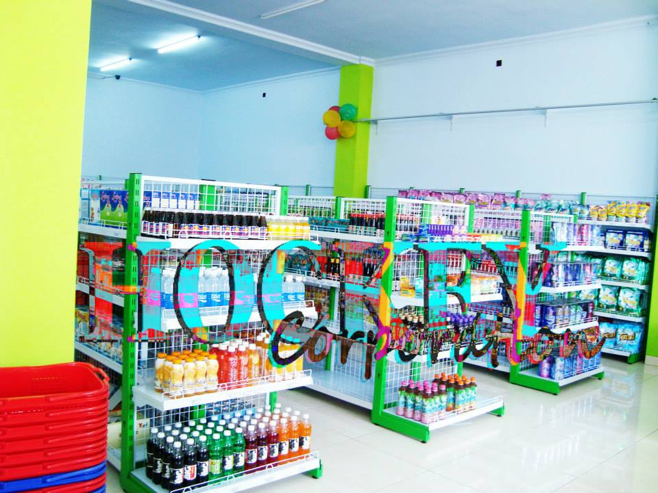
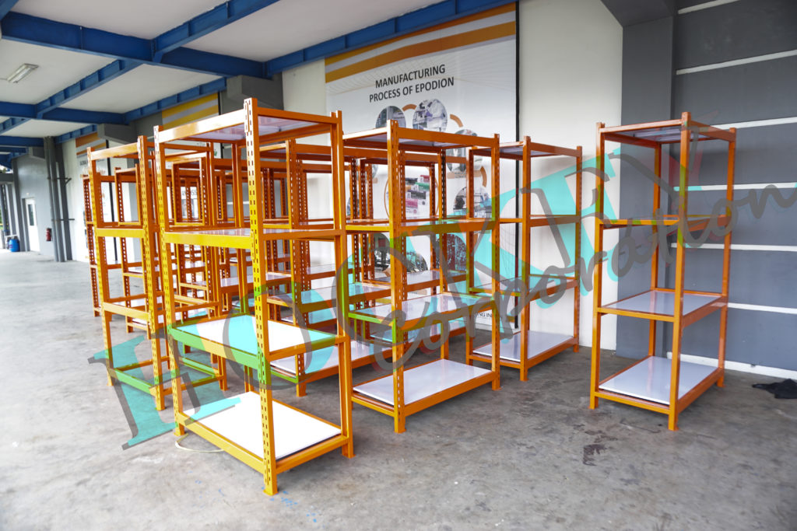

Apa saja sih model dan type rak toko rak supermarket rak minimarket.

###[macam rak toko rak supermarket rak minimarket](/macamraktokosupermarket).

Setiap rak type memiliki masing masing variant seperti starter starting adalah awalan rak dengan dua tiang, join adjoining rak tambahan dengan satu tiang yang menopang pada starter rak,end merupakan pembuka dan penutu pada double rak dua sisi, single adalah rak satu sisi biasa disebut dengan wall karena penempatanya kebanyakan berada menempel pada tembok , double adalah rak dengan sisi kanan dan kiri menjadi satu penempatan umumnya berada pada tengah ruangan,dan variant khusus tersedia adalah ram jaring dengan menggunakan jaring besi serta full plat minimalis konsep desain. 

###[RAK TOKO](/macamraktokosupermarket).
Rak yang umumnya digunakan pada toko toko modern seperti baby shop toys shop toko mainan anak dan toko perlengkapan bayi hingga pet shop serta berbagai toko lain nya, umumnya menggunakan variant tinggi single mulai dari 180cm - 200cm dan double dengan ukuran 120cm - 150cm.

###[RAK MINIMARKET](/macamraktokosupermarket).
Type ini hampir sama dengan rak toko karena kebanyakan dipakai pada minimarket maka produk ini biasa disebut dengan rak minimarket, dan khusus digunakan untuk usaha retail mart minimarket modern dalam kebutuhan nya untuk spesifikasi sama dengan rak toko sebelumnya.

###[RAK SUPERMARKET](/macamraktokosupermarket).
Special digunakan untuk usaha jenis supermarket dengan ruangan yang luas maka pemilihan yang biasa digunakan singgle tinggi 180cm - 200cm -220cm - 240cm double tinggi 120cm - 150cm - 180cm dengan kelebaran papan maksimal dalam kebutuhan akan supermarket ini.

###[RAK HEAVY](/macamraktokosupermarket).
Rak terbaik dengan kekuatan yang powerfull dalam menahan beban berat serta kebanyakan digunakan pada gudang maupun pada farmasi laboratorium dalam kegunaan nya, type rak ini menggunakan knock down memudahkan dalam setiap perakitan dan pemasangan nya.

Klik list untuk detail produk.
+ [Rak besi ram jaring murah](/rakmurah)
+ [Rak minimalis full plat besi](/rakminimalis)
+ [Rak heavy minimalis](/rakfarmasigudang)
+ [Meja kasir besi](/mejakasir)
+ [Mesin kasir system](/mesinkasir)
+ [Alarm security](/alarm)