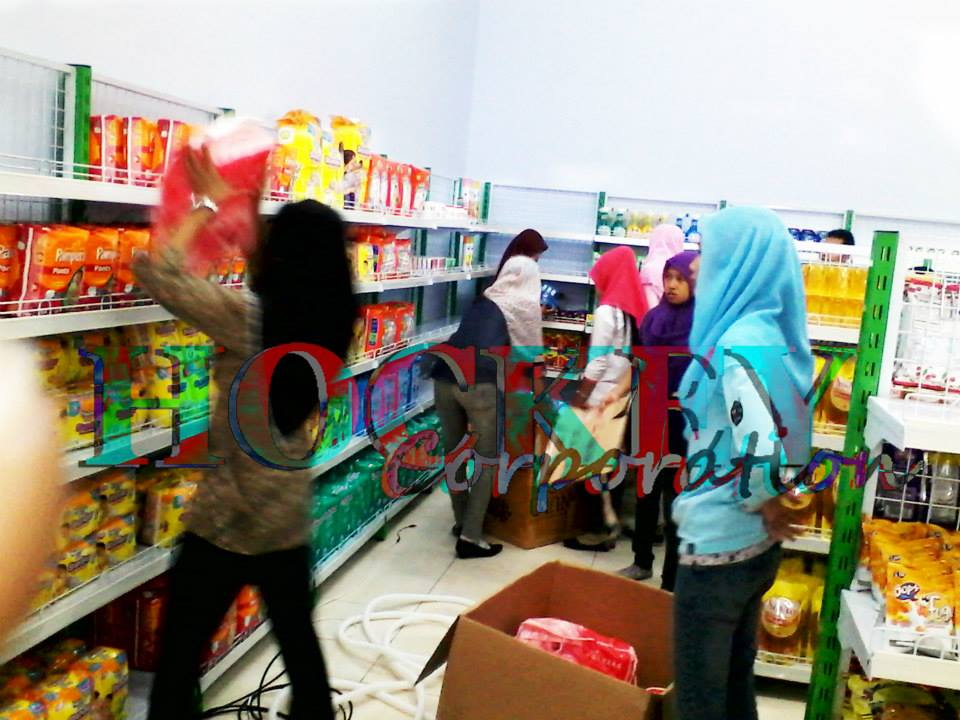

UKM harus mempunyai semangat 45 untuk berjuang bertahan hingga meraih sebuah kesuksesan.

###[cara memajukan usaha](/memajukanbisnis).

Sebuah usaha toko dan bisnis memiliki masing masing fase hingga grafik yang naik turun maupun stabil tak menentu dan tidak bisa diprediksi terlebih lagi dengan mimpi buruk krisis financial ekonomi yang tentu membuat daya beli akan menurun drastis,lantas apa yang harus kita lakukan ??

Tentunya semangat 45 yang membara wajib kita punya dengan masukan sugesti sugesti positif pada pemasaran agar menghapus negatif mu, berusaha dan berdoa itu pasti, dan jangan terlena dengan cara pemasaran mu saat ini, selalu ikuti perkembangan jaman lakukan upgrade dan update bisnis mu ikuti trend yang ada saat ini, ketika era ecommerce merajai maka mau tidak mau suka tidak suka kita wajib turut masuk dan terjun mengikuti nya,era kebebasan dan keterbukaan kini menjadi point plus,bantai harga itu pasti tapi tetap prioritas kan margin keuntungan jangan terlalu mepet agar mengingatkan bahwa kita bekerja dan bukan kerja bakti non profit.

Aktifkan saldo promosi untuk mendongkrak pemasaran , iklan saat ini terbuka luas baik via online shop ecommerce hingga sosial media dan google bisa kamu pilih, langkah terbaik dengan riset menganalisis semua iklan adds dari berbagai media,selanjutnya fokus lah pada iklan yang memberikan mu peluang lebih besar.

Tingkatkan otak kreatifitas pemasaran buat unik dan fresh agar pelanggan lebih tertarik hingga penasaran dengan schema marketing mu,hal ini dapat meningkatkan animo pembeli.

Berikan promosi dan diskon untuk pelanggan agar membantu menarik lebih banyak pelanggan untuk berbelanja pada toko bisnismu.

Fokus pada beberapa produk dan anggap sebagai icon bisnis usaha mu, jika menjual produk beraneka macam maka kini fokuslah pada beberapa produk dan buat image bahwa usaha kita memang yang paling murah dan termurah khusus untuk produk A misalnya, dengan icon murah ini membuat banyak pelanggan yang berbelanja maka tentu semua produk jual kita akan dilirik pelanggan ini dapat membantu mendongkrak posisi penjualan produk produk lain nya,dengan memberikan umpan produk A sebagai produk murah icon usaha kita akan membantu pemasaran produk produk lain.

Service terbaik dengan perhatian lebih kepada pelanggan bertindak cepat pada komplain akan memberikan efek mereka dihargai dan tentu nya harapan loyalitas pelanggan bisa didapatkan disini.

Cari supplier murah untuk produk produk mu, jika kini era kamu berhadapan langsung dengan supplier pada posisi pemasaran maka ,ciptakan sebuah produk atau buatlah paket produk baru dengan kreatifitas mu yang unik dan tentunya menarik.

Klik list untuk detail produk.
+ [Rak besi ram jaring murah](/rakmurah)
+ [Rak minimalis full plat besi](/rakminimalis)
+ [Rak heavy minimalis](/rakfarmasigudang)
+ [Meja kasir besi](/mejakasir)
+ [Mesin kasir system](/mesinkasir)
+ [Alarm security](/alarm)